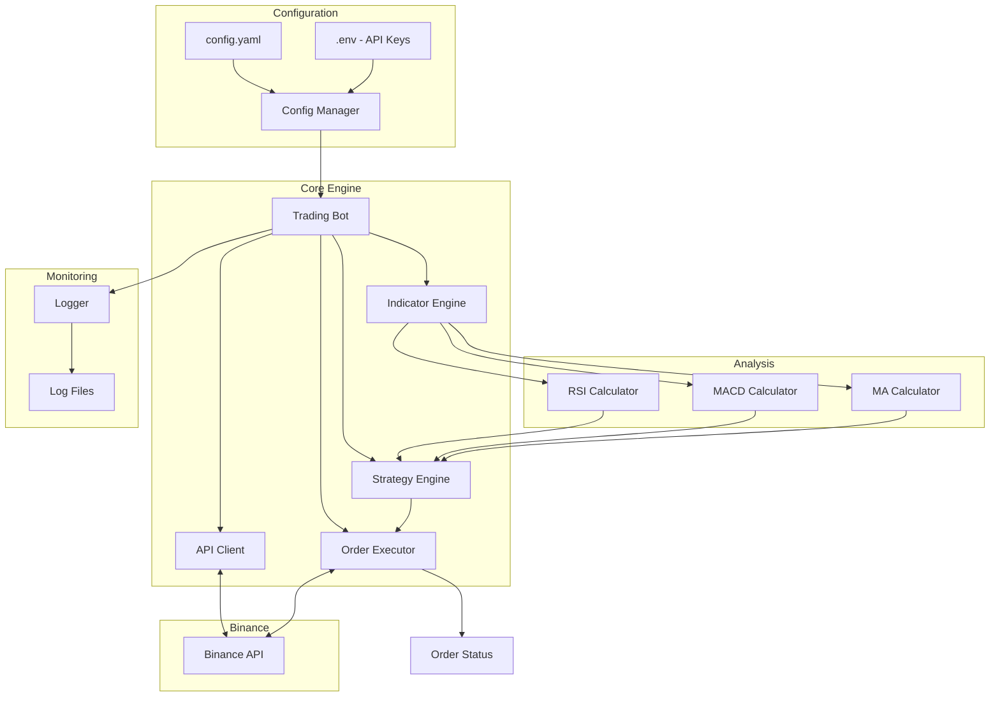

# Binance Trading Bot - Technical Specification

## Project Overview

A high-performance Go-based cryptocurrency trading bot that uses Technical Analysis indicators (RSI, MACD, Moving Averages) to execute real trades on Binance exchange.

## Technology Stack

- **Language**: Go 1.21+
- **Exchange**: Binance Spot API
- **Key Libraries**:
  - `github.com/adshao/go-binance/v2` - Official Binance API SDK
  - `github.com/spf13/viper` - Configuration management
  - `github.com/sirupsen/logrus` - Structured logging

## Project Structure

```
trade.ai/
├── cmd/
│   └── bot/
│       └── main.go              # Application entry point
├── internal/
│   ├── config/
│   │   └── config.go            # Configuration loading and validation
│   ├── api/
│   │   └── binance.go           # Binance API client wrapper
│   ├── indicators/
│   │   ├── rsi.go               # Relative Strength Index
│   │   ├── macd.go              # Moving Average Convergence Divergence
│   │   └── moving_average.go    # SMA/EMA calculations
│   ├── strategy/
│   │   └── technical.go         # Trading strategy logic
│   ├── trader/
│   │   └── executor.go          # Order execution manager
│   └── logger/
│       └── logger.go            # Logging setup and utilities
├── config/
│   └── config.yaml              # Configuration file
├── .env                         # Environment variables (API keys)
├── go.mod
├── go.sum
└── README.md
```

## Architecture



## Trading Strategy

### Entry Conditions

- **BUY Signal**:
  - RSI crosses above 30 (oversold to neutral)
  - MACD line crosses above signal line
  - Price above EMA(20)
- **SELL Signal**:
  - RSI crosses below 70 (overbought to neutral)
  - MACD line crosses below signal line
  - Price below EMA(20)

### Position Management

- Single position per trading pair
- Configurable stop-loss percentage
- Configurable take-profit percentage
- Trailing stop optional

## Configuration Parameters

```yaml
trading:
  symbol: "BTCUSDT" # Trading pair
  quantity: 0.01 # Base order quantity
  stop_loss_pct: 2.0 # Stop loss percentage
  take_profit_pct: 5.0 # Take profit percentage

indicators:
  rsi_period: 14
  rsi_oversold: 30
  rsi_overbought: 70
  macd_fast: 12
  macd_slow: 26
  macd_signal: 9
  ema_period: 20

api:
  base_url: "https://api.binance.com"
  timeout_seconds: 30

logging:
  level: "info"
  file: "logs/bot.log"
```

## Security Considerations

1. **API Keys**: Stored in `.env` file, never committed to version control
2. **Read-Only Mode**: Can be configured with read-only API keys initially
3. **Rate Limiting**: Built-in delays to respect Binance API limits
4. **Order Validation**: Double-check all orders before execution

## Implementation Steps

### Phase 1: Foundation

1. Initialize Go module and install dependencies
2. Create configuration system with Viper
3. Set up logging infrastructure
4. Implement Binance API client wrapper

### Phase 2: Technical Analysis

5. Implement RSI calculator
6. Implement MACD calculator
7. Implement Moving Average calculations (SMA, EMA)

### Phase 3: Trading Logic

8. Build strategy engine combining all indicators
9. Implement order executor with proper error handling
10. Add position management and risk controls

### Phase 4: Operations

11. Create main bot loop with proper shutdown handling
12. Add health checks and monitoring
13. Write comprehensive README
